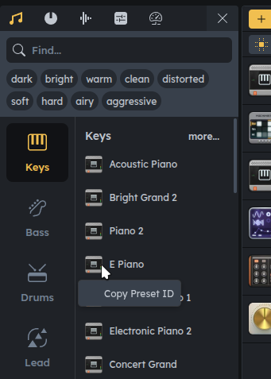

Next to syncing audiotool document, the package provides bindings to a subset of APIs from the audiotool platform. The APIs are auto generated from [our proto files](https://developer.audiotool.com/explore-protobufs), wrapped in our own client called {@link api.RetryingClient}. The apis can be found at the field {@link index.AudiotoolClient.api}, which is of type {@link api.AudiotoolAPI}:

```ts
const client = await createAudiotoolClient({ ... })
const projects = await client.api.projectService.listProjects({})
```

Since the types are auto-generated, they're a bit hard to read. The type:

```ts
createProject: {
  I: typeof CreateProjectRequest
  kind: Unary
  name: "CreateProject"
  O: typeof CreateProjectResponse
}
```

denotes a method taking {@link api.CreateProjectRequest} and returning {@link api.CreateProjectResponse}, simple objects. Your editor will help.

## Cheat sheet

{@link api.ProjectService}:

- list projects
- create, update and delete projects
- list "collab sessions" (i.e. DAW clients) connect to a project

{@link api.SampleService}:

- create, update, delete sample objects (sample metadata)
- download a sample using the name in the {@link entities.Sample} entity
- upload new samples to the backend

{@link api.ProjectRoleService}:

- list, add, remove users to your project as collaborators

{@link api.UserService}:

- list, delete, update users
- upload user avatars

{@link api.AudiographService}

- get audio graphs (vector graphics used in the sample browser)

{@link api.PresetUtil}:

A wrapper around the preset's API. Presets are device configurations that can be applied to existing devices to create a specific sound/effect. You can copy preset ids in the preset browser in the DAW:


