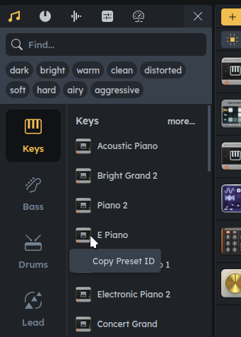

Next to syncing audiotool documents, the package provides bindings to a subset of APIs from the audiotool platform. The APIs are auto generated from [our proto files](https://developer.audiotool.com/explore-protobufs), wrapped in our own client called {@link api.RetryingClient}.

The APIs are available directly on the client:

```ts
const client = await createAudiotoolClient({ ... })
const projects = await client.projects.listProjects({})
const users = await client.users.getWhoami({})
```

Since the types are auto-generated, they're a bit hard to read. The type:

```ts
createProject: {
  I: typeof CreateProjectRequest
  kind: Unary
  name: "CreateProject"
  O: typeof CreateProjectResponse
}
```

denotes a method taking {@link api.CreateProjectRequest} and returning {@link api.CreateProjectResponse}, simple objects. Your editor will help.

## Available Services

| Client Property | Service | Description |
|-----------------|---------|-------------|
| `client.projects` | {@link api.ProjectService} | List, create, update, delete projects |
| `client.projectRoles` | {@link api.ProjectRoleService} | Manage collaborators on projects |
| `client.users` | {@link api.UserService} | List, delete, update users |
| `client.samples` | {@link api.SamplesAPI} | Upload, download, manage samples |
| `client.presets` | {@link api.PresetsAPI} | Get and apply device presets |
| `client.audioGraph` | {@link api.AudiographService} | Get audio graphs (waveforms) |

## Cheat sheet

**`client.projects`** ({@link api.ProjectService}):

- list projects
- create, update and delete projects
- list "collab sessions" (i.e. DAW clients) connected to a project

**`client.samples`** ({@link api.SamplesAPI}):

A high-level wrapper around the underlying {@link api.SampleService} that takes care of the multi-step upload/processing flow:

- `upload({ file, displayName, ... })` — upload an audio file. Returns a {@link api.SampleUpload} immediately. `await upload.uploaded` for the bytes to be safely on the server, `await upload.ready` for the full {@link api.SampleMeta} with download URLs.
- `get(sample)` — fetch {@link api.SampleMeta} by name or UUID.
- `list({ filter, textSearch, orderBy, pageSize, pageToken })` — paginated search over the sample library.
- `download(sample, { format })` — fetch the audio bytes back as a `Blob` (formats: `flac` / `wav` / `mp3` / `preview`). Waits for processing if the sample is still being transcoded.
- `delete(sample)` — delete a sample you own (only allowed if no project uses it).

```ts
const upload = await client.samples.upload({ file, displayName: "My Kick" })
if (upload instanceof Error) throw upload

const sample = await upload.ready // wait for transcoding
if (sample instanceof Error) throw sample

await nexus.modify((t) => t.insertSample(sample))
```

Pass an {@link api.SampleMeta} (or a plain `{ name, durationSeconds, bpm? }`) to {@link document.TransactionBuilder.insertSample} to drop it on the project timeline. {@link api.SampleUpload} on its own is not enough — it doesn't carry `durationSeconds` until `upload.ready` resolves.

**`client.projectRoles`** ({@link api.ProjectRoleService}):

- list, add, remove users to your project as collaborators

**`client.users`** ({@link api.UserService}):

- list, delete, update users
- upload user avatars

**`client.audioGraph`** ({@link api.AudiographService}):

- get audio graphs (vector graphics used in the sample browser)

**`client.presets`** ({@link api.PresetsAPI}):

A wrapper around the preset's API. Presets are device configurations that can be applied to existing devices to create a specific sound/effect. You can copy preset ids in the preset browser in the DAW:


