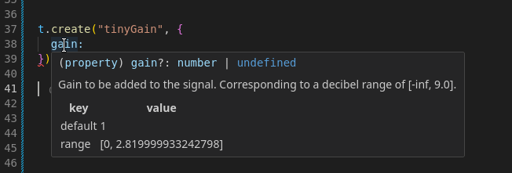

> [!WARNING]
> The package should be considered "early alpha" and can change **significantly** between releases, even between minor version numbers.

## 0.0.12

- updated networking code to work better in node.js: Connection no longer hangs on creation, and termination after `nexus.stop()` is faster.
- added type exports for logged in / logged out variants of logged in status: type {@link index.LoginStatus} = {@link index.LoggedInStatus} | {@link index.LoggedOutStatus}

## 0.0.11

- {@link index.AudiotoolClient.createSyncedDocument} changed it's signature: `mode: "online"` is no longer needed - the document is always
  online and synced:

  ```
  const client = ...
  const nexus = await nexus.createSyncedDocument({project})
  ```

- new function {@link index.createOfflineDocument}, allowing you to create offline documents without any network calls:

  ```
  const nexus = createOfflineDocument()
  ```

## 0.0.10

- enable creating multiple synced documents at once
- enable stopping an old document from syncing so it can be thrown away: {@link index.SyncedDocument.stop}.
  This will flush all existing modifications to the backend, then prohibit from using anything
  in the document other than {@link index.SyncedDocument.queryEntities}.
- improved link formatting in docs

## 0.0.9

- fixed bug in project synchronization logic that resulted in exceptions in certain situations
- internal restructuring in preparation for open sourcing
- validator wasm got a perf boost, reducing load time of projects

## 0.0.8

Change README file shown on npm.

## v0.0.7

## Internal Changes

- improved load time of package drastically by fetching wasm from CDN when running the package in the browser
- added tests for bun, node.js, and browser, preparing for CI tests
- restructure repo preparing to open source

### Documentation

- wrote document [Overview](./overview.md), giving a high level introduction of the package's functionality, and absorbing previous pages "Transaction Management", "Queries and Navigation", "Events and Changes", and "Core Concepts"
- rename "API Wrappers" to "API", rewrote, absorbed "Presets"
- improved docs of various typescript elements

## API

A few exports were moved around, otherwise no change.

## v0.0.6

We're now on npm! 🥳

Install the package with:

```sh
npm install @audiotool/nexus
```

## API

- refactored and simplified authentication. [Managing User Login](./login.md), documenting the API {@link index.getLoginStatus}
- updated the API bindings to the newest version, some change slipped through the last time

### Documentation

- updated [Getting Started](./getting-started.md), [Managing User Login](./login.md), and the quick start example in the [index](./README.md)

## v0.0.5

This is a big update with lots of changes! Existing apps will sadly break, but we hope these updates will make writing nexus apps
more fun and easy to use!

Here's a summary:

- the ability to self host your app!
- the new gakki soundfontplayer & audio region repitching: {@link entities.Gakki}, {@link entities.AudioRegion | FOO}.
- a major revision of the entire API structure - hopefully the last one!

> [!NOTE]
> You must update your package to keep your app working, older versions won't work anymore.

The biggest changes in the API revision are:

- The `DesktopPlacement` message is gone. It's content (`x`/`y` position and `display_name`) is now directly inside the messages that `DesktopPlacement` used to point to: `t.create("tonematrix", {positionX: 2, positionY: 3, displayName: "foo"})`
- The `Stagebox` message is gone - the `MixerMaster` (formerly: `MixerOut`) contains the stagebox's `x/y` positions directly
- Mixer strips don't have to point to the `MixerMaster` (formerly: `MixerOut`) anymore:
  - Channels, Group and Aux strips don't have to be connected to the master anymore, they're implicitly connected
  - `MixerStripCable` renamed to `MixerStripGrouping`, and is used purely for grouping strips

These changes address the issue where API users:

- forget to add `DesktopPlacement` -> device not visible on the desktop
- forget to add `Stagebox` -> stagebox not visible on the desktop
- forget to add a `MixerStripCable` -> mixer strip not shown, nothing audible

Now you can forget all these things for good!

Further, the SDK itself got an update in documentation & package names:

- new top level package names: `api-types` -> `api`, `entity-types` -> `entities`
- removed `Type` suffix for entity names: `TonematrixType` -> `Tonematrix`
- removed entity messages from api exports, confusing
- grouped entities at {@link entities}
- created an overview of all entities, see [Entities Overview](./entities.md)

Other important changes:

<details>
<summary>Other important changes</summary>

- `PatternRegions` on the timeline no longer have to have a pointer to the pattern device - the device is only referenced through the `PatternTrack` itself; the pattern index through the `pattern_index` field in the region.
- `Beatbox8`, `Beatbox9`, `Machiniste`: pattern step duration is set to an enum rather than tick duration
- **Hundreds of fields got better documentation and names**, and dozens got more sensible validity ranges.
- `CentroidChannels` can now properly be ordered using `order_among_channels`, a float-based ordering similar to tracks
- `Rasselbock` effects are ordered similarly: in an array of `float`s
- `WaveshaperAnchor`s can no longer generate an invalid waveshaper - 1 anchor point is always implicitly present

</details>

## v0.0.4

### API

- expanded subscription capabilities for event manager, see {@link document.NexusEventManager}:
  - `nexus.events.onCreate("*", ...)` to subscribe to _any_ entity being created
  - `nexus.events.onRemove("*", ...)` to subscribe to _any_ entity being removed
  - ```ts
    nexus.events.onCreate("...", () => {
      return () => console.debug("removed")
    })
    ```
    to subscribe to the removal of an entity that was just created

- added better "presets" API wrapper to more easily access presets. See ~~Presets~~

### Documentation

- Added default values & validity ranges to the documentation of fields in the "constructor types", the second argument e.g. for `t.create("foo", {...})`.

  This means you can now hover the parameter to see it's validity range:

  

- Document what pointer fields point to by linking to all locations. See e.g. {@link entities.DesktopAudioCable.fromSocket}
- Remove default from required pointers; confusing because required pointers' default values will result in a transaction error
- Fix incorrect example in ~~Core Concepts~~
- Add documentation pages:
  - ~~Events and Changes~~
  - ~~Presets~~

### Bug Fixes

- fix a bug in the validator that would cause the removal of certain entities to result in a transaction errors when it shouldn't have

## v0.0.3

### API

- Expose new `Ticks` constants & conversion methods to more easily work with time units

### Documentation

- add links to `EntityQuery` to `Queries and Navigation` docs, links to `TransactionBuilder` to `Transaction Management` docs

## v0.0.2

### API

- started versioning package so we can communicate changes here
- remove `setPAT` & `hasPAT` from `AudiotoolClient`. Instead, pass the PAT directly to `createAudiotoolClient`. They relied on `localStorage`, making them harder to run on platforms other than the web. Users should manage the PAT themselves, and pass in when creating the client. For websites, you could use e.g. [localStorage](https://developer.mozilla.org/en-US/docs/Web/API/Window/localStorage).
- improve error message if calling `nexus.createTransaction()` before calling `nexus.start()`

### Documentation

- added instructions on how to get started with vite in [Getting Started](./getting-started.md)
- generate documentation on the target type of each entity (e.g. {@link entities.Heisenberg} "is" DesktopPlaceable, NoteTrackPlayer), which was missing. Added distinction between entity & objects.
- typos, wording, consistency

## v0.0.1

First release!
