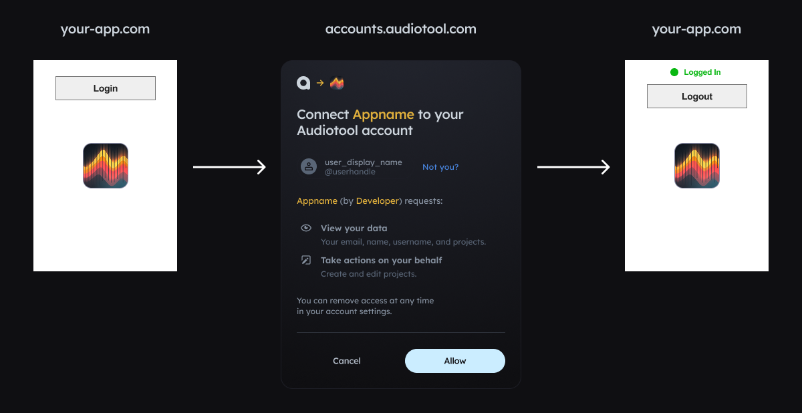

This package allows you read and modify projects of other users. To do that, it has to be authorized to make API calls on that user's behalf. This user can be you, or other users that use your app.
On this page we explain how you can authorize your app, so you and others can use it on their own projects.

For apps running in the browser, app authorization typically looks like this:

1. User presses "Login" on your page
2. User is shown a page on audiotool.com asking "This app requests to do xyz for you, Allow?"
3. User presses "Allow" and comes back to your page, now logged in



> [!NOTE]
> The login flow described here is intended for browser-based apps. For server-side apps, see [Node.js Usage](#nodejs-usage) or [PAT-based authentication](#pat-based-authentication).

## Registering your application

Register your application on developer.audiotool.com/applications. Press "Create Application" and fill in the following details:

- Name/Description/Project URL - as you want
- Redirect URI: enter `https://127.0.0.1:5173/` for now, later your project's deployed URL
- scopes: `project:write` for creating a synced document

## Running your server on `127.0.0.1:5173`

We just set "redirectURI" to `http://127.0.0.1:5173/`. This is the URL that accounts.audiotool.com forwards the user back to after
they press allow. If you deploy your app to `foo.com`, you will have to add `https://foo.com/` to that list.

For security reasons, this URL can't be `localhost`. Instead, we have to configure the local dev server to host our app
under the `http://127.0.0.1:5173/`. In vite, you can do this as follows: Open `vite.config.ts` (or create it if it doesn't exist yet) and add the following:

```ts
import { defineConfig } from 'vite'

export default defineConfig({
  ...
  server: {
    host: '127.0.0.1',
    ...
    port: 5173,
  },
})
```

## Browser Authentication

Use the `audiotool()` function to authenticate users in the browser. It handles the OAuth2 PKCE flow automatically and returns a client you can use directly.

```ts
import { audiotool } from "@audiotool/nexus"

const at = await audiotool({
  clientId: "<client-id of your app>", // hardcode this — it's not a secret
  redirectUrl: "http://127.0.0.1:5173/",
  scope: "project:write",
})

if (at.status === "authenticated") {
  // at IS the client - use it directly
  console.log(`Logged in as ${at.userName}`)
  const projects = await at.projects.listProjects({})
} else if (at.status === "unauthenticated") {
  if (at.error) {
    console.error("Auth error:", at.error)
  }
  console.log("Not logged in")
}
```

The return value has two possible states:

- `authenticated`: User is logged in. The object IS the client - call `at.projects.listProjects({})` etc. directly on it.
- `unauthenticated`: User is not logged in. Call `at.login()` to start the OAuth flow. If authentication failed previously, `at.error` will be set.

Wire up login/logout buttons based on the status:

```ts
const createButton = (text: string, onClick: () => void) => {
  const button = document.createElement("button")
  button.innerHTML = text
  button.addEventListener("click", onClick)
  document.body.appendChild(button)
}

if (at.status === "authenticated") {
  createButton("Logout", () => at.logout())
  console.debug("Logged in as", at.userName)
} else if (at.status === "unauthenticated") {
  createButton("Login", () => at.login())
}
```

## Full Browser Example

```ts
import { audiotool } from "@audiotool/nexus"

const createButton = (text: string, onClick: () => void) => {
  const button = document.createElement("button")
  button.innerHTML = text
  button.addEventListener("click", onClick)
  document.body.appendChild(button)
}

const at = await audiotool({
  clientId: "bd496109-d9b4-4b6a-8519-8b6ce88b58c5",
  redirectUrl: "http://127.0.0.1:5173/",
  scope: "project:write",
})

if (at.status === "authenticated") {
  console.debug("Logged in as", at.userName)
  createButton("Logout", () => at.logout())
  
  // at IS the client - use it directly
  const projects = await at.projects.listProjects({})
  console.log("Projects:", projects)
} else if (at.status === "unauthenticated") {
  if (at.error) {
    console.error("Auth error:", at.error)
  }
  console.debug("Logged out.")
  createButton("Login", () => at.login())
}
```

## Deploying your app

To deploy your app, you need to update the `redirectUrl` so that the user is redirected to your page's URL rather than `http://127.0.0.1:5173/`. To do this:

- add that (entire) URL as "redirectURI" on your app at developer.audiotool.com/applications
- when calling `audiotool`, pass that URL as `redirectUrl`

## Troubleshooting

- make sure the `redirectURL` matches the `redirectURI` you specified on developer.audiotool.com/applications _exactly_ - pay attention in particular to the `/` character in the end.
- if you get `insufficient_permissions` error even if logged in, the "Scopes" you set in your app & pass to `audiotool` are likely insufficient for the API calls you're trying to make.
  The `projects:write` scope we use in the example above grants access to create and modify projects, but for other API calls, other scopes are needed. We're working on documentation in that regard.

  If you need more scopes, update your app on developer.audiotool.com/applications, and then pass the scopes to `audiotool`, separated by spaces. Already logged in users
  have to be logged out & in again for the new scopes to take effect. If your app is already deployed and users are already logged in, consider creating a new application on developer.audiotool.com/applications
  so all users are automatically logged out again. We'll make this process smoother at some point.

- for more issues and questions, join our discord: https://discord.gg/5Cde4Zvret

> [!NOTE]
> Client ID, scopes, and redirect URIs can safely be:
>
> - hard-coded into your app
> - checked into git
> - sent to your users' browsers
> - shared with friends and foes
>
> Only websites at the redirect URIs you specify for your app on developer.audiotool.com can use it to authorize their apps.

## Node.js Usage

For Node.js, Bun, or Deno server-side apps, the recommended approach is to authenticate users in the browser and hand off their tokens to the server.

### Server-side with User Tokens

If you have a web app where users authenticate in the browser, you can use their tokens server-side (e.g., in Next.js API routes, Express handlers, etc.):

**Browser side - export tokens:**
```ts
import { audiotool } from "@audiotool/nexus"

const at = await audiotool({...})

if (at.status === "authenticated") {
  // Export tokens to send to your server
  const tokens = at.exportTokens()
  
  // Store in your session (cookie, etc.)
  await fetch("/api/store-session", {
    method: "POST",
    body: JSON.stringify(tokens),
  })
}
```

**Server side - use tokens:**
```ts
import { createAudiotoolClient, createServerAuth } from "@audiotool/nexus"
import { createNodeTransport, createDiskWasmLoader } from "@audiotool/nexus/node"

// In your API route handler
export async function handler(req, res) {
  const { accessToken, refreshToken, expiresAt } = req.session
  
  const client = await createAudiotoolClient({
    auth: createServerAuth({
      accessToken,
      refreshToken,
      expiresAt,
      clientId: "your-client-id",
      // Persist refreshed tokens back to session
      onTokenRefresh: (newTokens) => {
        req.session = { ...req.session, ...newTokens }
      },
    }),
    transport: createNodeTransport(),
    wasm: createDiskWasmLoader(),
  })
  
  const projects = await client.projects.listProjects({})
  res.json(projects)
}
```

## Advanced

### PAT-based authentication

For server-side apps that you don't plan to ever share with other users, you can use a [Personal Access Token](https://developer.audiotool.com/personal-access-tokens):

```ts
import { createAudiotoolClient } from "@audiotool/nexus"
import { createNodeTransport, createDiskWasmLoader } from "@audiotool/nexus/node"

const client = await createAudiotoolClient({
  auth: "at_pat_238u098i23...",
  transport: createNodeTransport(),
  wasm: createDiskWasmLoader(),
})
```

> [!WARNING]
> The PAT grants full access to your **entire audiotool account**. Never share it with others or check it into git!!

### Using credentials in your own network calls

If you'd like to make your own calls to our API and use `audiotool()` to handle authentication, you can extract the token:

```ts
const at = await audiotool({...})

if (at.status === "authenticated") {
  const tokens = at.exportTokens()
  
  fetch(apiUrl, {
    credentials: "omit",
    headers: {
      authorization: `Bearer ${tokens.accessToken}`,
    },
  })
}
```

