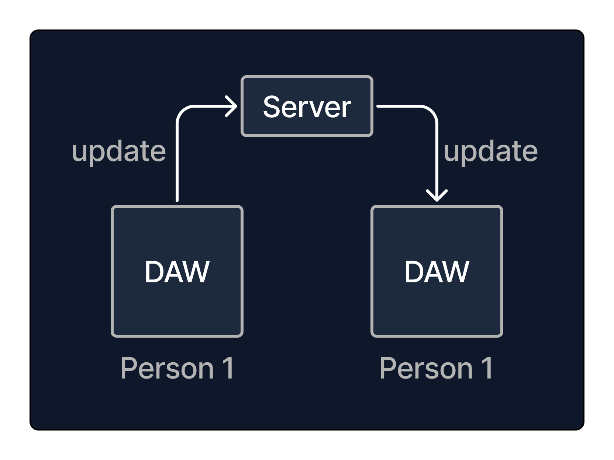
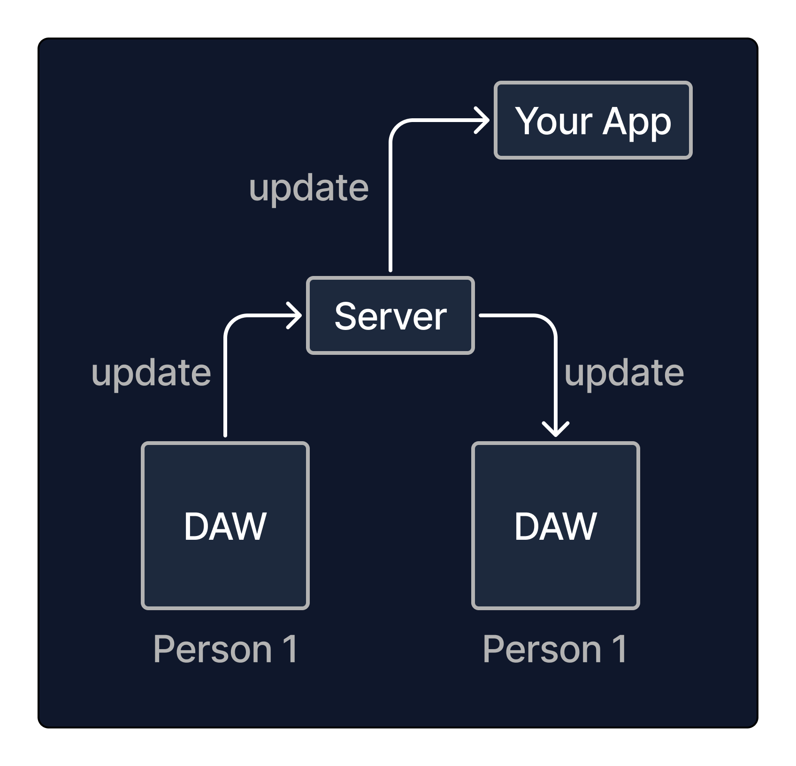
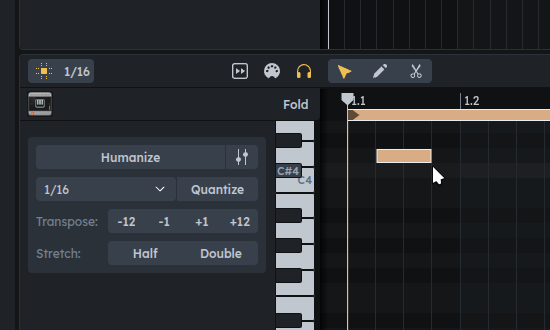
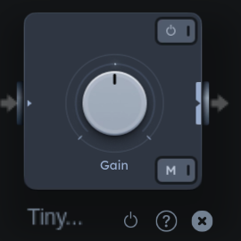
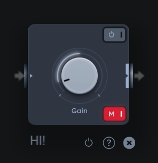
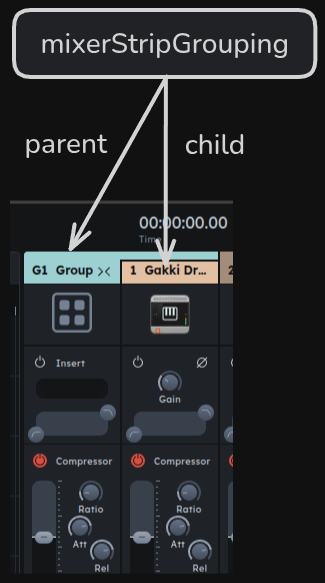
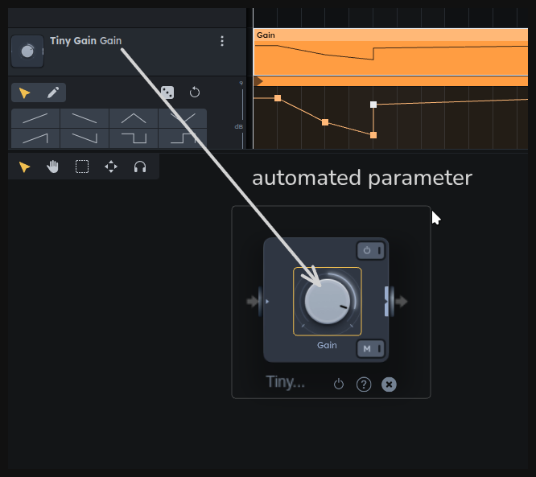

# What is this?

This package gives you the ability to **write audiotool projects
programmatically**, in their entirety: Every audiotool project ever created on audiotool.com
could be generated using this package. But this description alone doesn't quite give it justice.

**Audiotool is a _multiplayer_ DAW**. This means that multiple people can open the same project at the same time, and
see each others changes in real time as they happen. If person 1 turns a knob, person 2 that has the same
project open must immediately see that knob turn as well.

This involves that the DAW communicates with the server after every tiniest change to the project.
Every single update the project, no matter how small, must be sent to the backend server, which
then forwards that update to all other DAWs:



And in turn, if person 2 changes something else, that change must be propagated back to person 1, and so on.

To accomplish this, we wrote a typescript framework that allows us to listen to and create these changes
in one go, "binding our code" to the underlying datastructure that is an audiotool project,
so that it can react to updates, and create new updates.

This package is this framework. **It allows you to create a bot that participates in an audiotool
collaborative session in just the same way as our DAW does.**



You can write entire audiotool projects from scratch if you like, but you can also write apps
that modify projects _continuously_ or react to changes users that are working in the DAW make,
and all users will see the changes you make in real time, as they happen.

Note that real time here means mostly _fast_, but not (yet) in sync with the playhead in the studio. For example, in central Europe you can expect a latency between 150-300ms to our API-Servers in US-Central. However we will provide servers on other continents in the future to achieve lower latencies.

## Entities

The basic building blocks on an audiotool project (from here on referred to as a "document") are what we call **entities**.

Entities are small objects with a defined set of fields, like `{ gain: 0.3, mix: 0.2}`. Each entity has a field `id` that uniquely identifies
that entity, and a type (like `stompboxDelay`) that determines which fields it contains and the meaning it has for the DAW.

A document is a set of these entities in no particular order.

Some examples of entities:

- Entity of type `"note"` describes a note on the timeline:

  

  It contains fields:

  ```ts
  {
    positionTicks: number // position in timeline
    durationTicks: number // duration
    pitch: number // note played
    velocity: number // velocity of note
    doesSlide: boolean // whether this note should slide (right click -> "Slide")
    collection: pointer // what the note belongs to
  }
  ```

- Entity of type `"tinyGain"` describes a Tiny Gain device on the desktop:

  

  It contains fields:

  ```ts
  {
    displayName: string // name assigned to the device
    positionX: number // x position on the desktop
    positionY: number // y position on the desktop
    gain: number // the gain knob's value
    isActive: boolean // if device is turned on
    isMuted: boolean // if the mute button is pressed

    audioInput: empty // socket for cable
    audioOutput: empty // socket for cable
  }
  ```

To create a new entity, you can call `t.create` on the {@link document.TransactionBuilder} object, which we'll go into below. For now,
consider the example where a `tinyGain` is created:

```ts
t.create("tinyGain", {
    gain: 0.2,
    positionX: 30
    positionY: 40
    isActive: true,
    isMuted: true,
    displayName: "HI!",
})
```

This will create an entity of type `tinyGain` and insert it into the document. If you open the studio view, you will see this:



An overview of all entity types can be found in [Entities](./entities.md).

## Pointers

Pointers are a kind of fields that can point to other entities to create semantic relationships.

For example, a `"note"` has a field `collection` that must always point
to a `"noteCollection"` entity. A `mixerStripGrouping`, which groups mixer strips, points to a parent strip that is the group,
and the child strip that is grouped:



Pointer fields can also point to specific _fields_ within entities. An `"automationTrack"` that automates the parameter called "gain"
of a Tiny Gain has a pointer pointing to the Tiny Gain's `gain` field:



The value of a pointer is called a "location", since it points to a "location in the document". Every entity and field created has a property `location` that can be used to construct new pointer fields.

For example, an automation track can be created like this:

```ts
const tinyGain = t.create("tinyGain", {})

const automationTrack = t.create("automationTrack", {
  automatedParameter: tinyGain.fields.gain.location,
  // left out fields fall back to defaults
})
```

Not all pointer values are valid. You can see which locations a pointer field can point to in the API docs, like
here: {@link entities.AutomationTrack.automatedParameter}.

## Modifying the document

Creating/modifying a document means either:

- adding a new entity to the set of entities
- updating a field of an existing entity
- removing an entity of the set of entities

These three basic method of modification can be performed using the {@link document.TransactionBuilder} object:

```ts
// add entity to set
const tinyGain = t.create("tinyGain", {})
// update field of entity
t.update(tinyGain.fields.gain, 0.4)
// remove entity from set
t.remove(tinyGain)
```

The {@link document.TransactionBuilder} has other useful methods than these three, but they are all converted to a list of these three basic modifications.

## Getting a transaction builder

Now, let's look at how we get access to this mysterious object `t`.

Since audiotool is multiplayer, you have to expect the document to change at any point while you're working with it.

For this reason, you first have to acquire a **document lock** before making changes to it. While you hold that lock in your code,
the document is prohibited from updating itself; the only changes allowed to happen are the ones you make.

You can acquire the document lock by requesting access to a {@link document.TransactionBuilder} object, which also
contains the methods needed to make changes. The easiest way to get that object is by calling `modify`:

```ts
nexus.modify((t) => {
  t.create("tinyGain", {})
})
```

Here, the object `t` is the {@link document.TransactionBuilder}. The lock is held for the duration of the method you pass in - once it returns, the lock is released, and the {@link document.TransactionBuilder} object becomes invalid.

Note that because you have to acquire the lock, the function you pass to `modify` might not execute immediately. You can `await`
the `modify` call to make sure that the function you pass has executed:

```ts
nexus.modify((t) => {
  console.debug("Hey")
})
console.debug("there")

// might output: there, Hey

await nexus.modify((t) => {
  console.debug("Hey 2")
})
console.debug("there 2")

// will always output: Hey 2 there 2
```

An alternative, more explicit way to get the builder and release it is this:

```ts
const t = await nexus.createTransaction()
t.create("tinyGain")
t.send() // release lock & sync with backend
```

The lock acquired with the transaction builder is local to your client. Other clients - like users looking at the same project in the DAW -
can continue making changes as before. Only after you release the lock will the changes be sent to the backend and the other clients.
Potential consistency conflicts are resolved automatically by the backend and propagated back to your client.

If you are _not_ holding the transaction lock, the document can change at any time. For example, the following can result in an
exception being thrown:

```ts
const tinyGain = await nexus.modify((t) => {
  return t.create("tinyGain")
})

// lock is not held here

await nexus.modify((t) => {
  t.remove(tinyGain) // might not exist anymore, throwing an exception
})
```

## Events

To listen to and react to changes made in the document (made by your app or other users) you can use the `events` field on the document, found at {@link index.SyncedDocument.events}. For example, to hear of updates
to a field, you can do:

```ts
await nexus.modify((t) => {
  const tinyGain = t.create("tinyGain", {})
  nexus.events.onUpdate(tinyGain.fields.gain, (g) =>
    console.debug("gain updated to", g),
  )
})
```

When changing the document locally, event callbacks are triggered while the transaction
builder method executes:

```ts
await nexus.modify((t) => {
  const tonematrix = t.create("tonematrix", {})

  nexus.events.onUpdate(tonematrix.fields.positionX, () => {
    console.debug("(2) updating")
  })
  console.debug("(1) will update")
  t.update(tonematrix.fields.positionX, 2)
  console.debug("(3) have updated")
})
```

Output:

```txt
(1) will update
(2) updating
(3) have updated
```

The method {@link index.SyncedDocument.start} exists so that event callbacks can be setup
before syncing starts - before it's called, remote changes are withheld, and you can't get a {@link document.TransactionBuilder} yet.

This allows you to setup all event callbacks without missing any entity creations:

```ts
nexus.events.onCreate("tonematrix", () => {...})
await nexus.start()
// could start modifying here
```

### Cheat sheet

Subscribe to the creation of an entity of a specific type:

```ts
nexus.events.onCreate("tonematrix", (tonematrix) => {
  // tonematrix created
  return () => {
    // tonematrix removed
  }
})
```

Subscribe to the creation of all entities:

```ts
nexus.events.onCreate("*", (entity) => {
  // entity created
  return () => {
    // entity removed
  }
})
```

Subscribe to a field being updated:

```ts
nexus.events.onUpdate(tonematrix.fields.positionX, (x) => {
  // positionX field updated to `x`
})
```

Subscribe to a location being pointed to:

```ts
nexus.events.onPointingTo(tonematrix.fields.audioOutput.location, (source) => {
  // source started pointing to fromSocket
  return () => {
    // source stopped pointing to fromSocket
  }
})
```

Subscribe to an entity being removed:

```ts
nexus.events.onRemove(tonematrix, () => {
  // tonematrix removed
})
```

Terminating a subscription:

```ts
const sub = nexus.events.onCreate(...)
sub.terminate()
```

See more at {@link document.NexusEventManager}.

## Queries

Queries allow you to inspect the current state of the document, such as getting all entities of a specific type.

Queries are built by chaining method calls on the {@link document.EntityQuery} object, followed by call to `.get()`, which returns the query result. The query object can be found at {@link index.SyncedDocument.queryEntities}.

The simplest query returns all entities currently in the document:

```ts
const allEntities = nexus.queryEntities.get()
console.debug("document contains", allEntities.length, "entities")
```

You can add filters before calling `.get()` to get more specific entities. Here's how to get all entities of type `"note"`:

```ts
const notes = nexus.queryEntities.ofTypes("note").get()
console.debug("document contains", notes.length, "notes")
```

The query object can also be used to find an entity with a specific id:

```ts
const device = nexus.queryEntities.getEntity(
  tinyGain.fields.gain.location.entityId,
)
```

As mentioned above, unless the document lock is held when modifying the document, the document can change at any point. Query results should thus be considered short lived. In particular, when building a transaction, you should query the document fresh once
you hold the transaction lock, otherwise you might run into transaction errors when
you update an entity that doesn't exist anymore. Consider:

```ts
const stompbox = .. // get stompbox somehow

await nexus.modify((t) => {
  t.update(stompbox.fields.mix, 0.3)
})
```

This code might throw on the line `t.update(...)` even if the stompbox previously existed,
since the stompbox might be removed while waiting for the transaction lock,
and updating an entity that doesn't exist is not allowed.

The solution here is to query the document for the existence of the entity while the document is locked:

```ts
const stompbox = .. // get stompbox somehow

await nexus.modify((t) => {
  if (nexus.queryEntities.has(stompbox)){
    t.update(stompbox.fields.mix, 0.3)
  }
})
```

### Cheat sheet

Get all entities in the query:

```ts
const entities = nexus.queryEntities.get()
```

Get one of the entities in the query:

```ts
const entity = nexus.entities.getOne()
```

Check if an entity is contained in the query:

```ts
const hasEntity = nexus.entities.has(myEntity)
```

Get an entity with a specific id, if it exists:

```ts
const audioSource = nexus.entities.getEntity(sourceId)
```

Get an entity with a specific id or throw:

```ts
const audioSource = nexus.entities.mustGetEntity(sourceId)
```

Get an entity of a specific id and a specific type, or return undefined.

This is more efficient than calling `nexus.entities.ofTypes("stompboxDelay").getEntity(sourceId)`, while keeping `delay` correctly typed:

```ts
const delay = nexus.entities.getEntityAs(sourceId, "stompboxDelay")
```

Get an entity with a specific id and of a specific type, or throw.

This is more efficient than calling `nexus.queryEntities.ofTypes("stompboxDelay").mustGetEntity(sourceId)`, while keeping `delay` correctly typed:

```ts
const delay = nexus.queryEntities.mustGetEntityAs(sourceId, "stompboxDelay")
```

Get all entities of one or multiple types:

```ts
const cables = nexus.queryEntities
  .ofTypes("desktopAudioCables", "desktopNoteCables")
  .get()
```

> Note: `cables` will be correctly typed, and you can call e.g.
> `cables[0].fields.fromSocket`, since this field is shared between cables.

Get all entities that point to something:

```ts
const groovy = nexus.queryEntities.pointingTo.entitiesOfType("groove").get()
const cables = nexus.queryEntities.pointingTo
  .locations(delay.fields.audioOutput.location)
  .get()
const notes = nexus.queryEntities.pointingTo.entities(collection.id).get()
```

Chaining filters:

```ts
const connectedDelays = nexus.queryEntities
  .ofTypes("stompboxDelay")
  .pointedToBy.entitiesOfType("desktopAudioCable", "desktopNoteCable")
  .get()
```

See more at {@link document.EntityQuery}.
